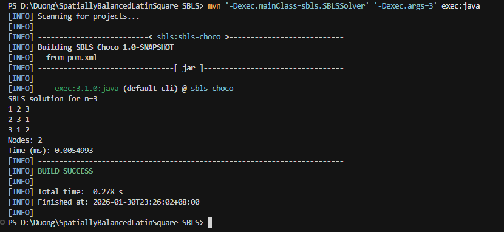
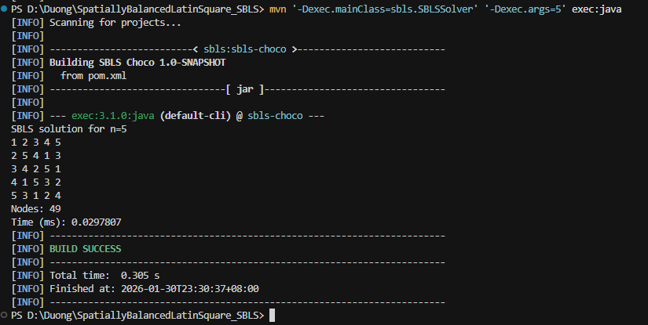
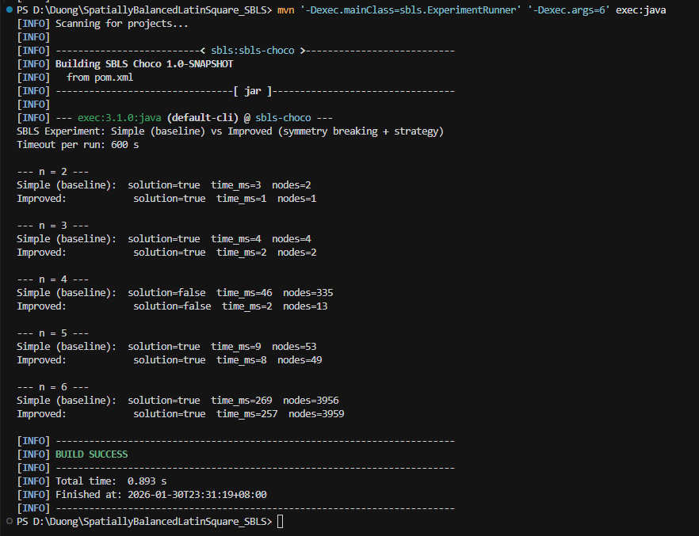

# REPORT — Spatially Balanced Latin Square (SBLS) (Choco CP)

**Student name**: thi thuy duong PHAM
**Student number**: 22511718   
**Environment**: Windows 10, Java 11, Maven 3.x, AMD Ryzen 7 7700 8-Core, 64gb RAM

## 1. Objective

Model and solve the **Spatially Balanced Latin Square (SBLS)** problem using **Constraint Programming** (Choco Solver), and report:

- Feasible SBLS solutions for selected orders \(n\)
- Performance metrics (**time** and **search nodes**)
- A comparison between **Simple (baseline)** and **Improved** configurations

## 2. Program structure

- `SBLSSolver`: solves SBLS for a **single** value of \(n\) and prints the square (if found)
- `ExperimentRunner`: runs multiple \(n\) values and prints **Simple vs Improved** statistics

## 3. How to run (PowerShell)

### 3.1 Compile

```powershell
mvn clean compile
```

### 3.2 Run the solver for one n

```powershell
mvn '-Dexec.mainClass=sbls.SBLSSolver' '-Dexec.args=3' exec:java
mvn '-Dexec.mainClass=sbls.SBLSSolver' '-Dexec.args=5' exec:java
```

Note: for this implementation, `n=4` prints **"No solution found"**.

### 3.3 Run experiments (Simple vs Improved)

```powershell
mvn '-Dexec.mainClass=sbls.ExperimentRunner' '-Dexec.args=6' exec:java
```

## 4. Results

### 4.1 Single-run solver outputs (SBLSSolver)

From terminal runs:

- **n = 3**: solution found, **Nodes = 2**, **Time (ms) = 0.0049326**
- **n = 5**: solution found, **Nodes = 49**, **Time (ms) = 0.0301092**

### 4.1 Meaning of the printed metrics

- **Nodes**: number of nodes visited in the search tree (lower is better)
- **Time (ms)**: runtime to find a solution or conclude unsatisfiability

### 4.2 Summary table (fill from `ExperimentRunner` output)

| n | Simple: solution | Simple: time_ms | Simple: nodes | Improved: solution | Improved: time_ms | Improved: nodes |
|---:|:---------------:|----------------:|--------------:|:------------------:|------------------:|----------------:|
| 2 | true  | 3   | 2    | true  | 1   | 1    |
| 3 | true  | 3   | 4    | true  | 2   | 2    |
| 4 | false | 47  | 335  | false | 2   | 13   |
| 5 | true  | 10  | 53   | true  | 6   | 49   |
| 6 | true  | 260 | 3956 | true  | 241 | 3959 |

### 4.3 Observations (detailed)

- **Correctness / feasibility by order**:
  - Solutions were found for \(n=2,3,5,6\) in both configurations (Simple and Improved).
  - For \(n=4\), both configurations reported **no solution** within the run (Simple: `solution=false`, Improved: `solution=false`). This suggests that \(n=4\) is likely **unsatisfiable** under the SBLS constraints as implemented, or at least much harder than neighboring values and quickly proven unsatisfiable by the improved model.

- **Impact of symmetry breaking (Improved vs Simple)**:
  - For \(n=2\) and \(n=3\), Improved reduces both **time** and **nodes** (e.g., for \(n=3\): nodes drop from 4 to 2).
  - The most visible improvement appears at \(n=4\): nodes drop from **335 → 13** and time from **47 ms → 2 ms**. This is consistent with the role of symmetry breaking: fixing the first row removes many symmetric branches and allows the solver to prove unsatisfiability much faster.
  - For \(n=5\), the improvement is modest but still consistent: nodes **53 → 49**, time **10 ms → 6 ms**.

- **Interesting case at \(n=6\)**:
  - Both configurations solve \(n=6\) with roughly the same number of nodes (~3950) and similar runtime (~240–260 ms).
  - The improved model even visits slightly more nodes (3959 vs 3956), which can happen because adding symmetry breaking and a fixed search strategy may change the search order: it does not guarantee fewer nodes for every instance, but it often improves performance in harder or highly symmetric cases.

- **Trend with increasing n**:
  - The search effort generally increases with \(n\), visible from nodes and time. For example, going from \(n=5\) (tens of nodes) to \(n=6\) (thousands of nodes) increases complexity significantly.
  - This matches expectations for CP on combinatorial designs: constraint density and symmetry strongly influence runtime, and improvements such as symmetry breaking can change the scaling behavior.

## 5. Model description

The CP model includes:

- Latin constraints: `allDifferent` on each row and each column
- Channeling between `grid` and `pos`
- Spatial balance enforced via a common total distance \(D\) for all color pairs
- **Improved** adds symmetry breaking (fix the first row to `1..n`) and an explicit search strategy

## 6. Technical implementation details (program-level)

This section briefly explains how the program is implemented in code (Choco CP).

### 6.1 Decision variables

The model (`SBLSCPModel`) uses:

- `grid[r][c]` (domain `1..n`): symbol/color at row `r`, column `c` (an \(n \times n\) Latin square).
- `pos[r][k]` (domain `0..n-1`): the column index where color `(k+1)` appears in row `r`.
- `D`: a shared distance value used for all unordered color pairs \((i,j)\), \(i<j\).

### 6.2 Core constraints

- **Latin square constraints**:
  - `allDifferent(grid[r])` for each row `r`
  - `allDifferent(column c)` for each column `c`

- **Channeling between `grid` and `pos`**:
  - For each row `r` and color `k`, the program enforces: if `pos[r][k] == c` then `grid[r][c] == k+1`.
  - Additionally, `pos[r]` is constrained by `allDifferent(pos[r])`, meaning each color has a unique position in the row.

- **Spatial balance constraint**:
  - For each color pair \((i,j)\), the distance is defined as:
    \[
      D_{ij} = \sum_{r=0}^{n-1} \left| pos[r][i] - pos[r][j] \right|
    \]
  - The SBLS requirement is enforced by setting `D_ij = D` for every pair \((i,j)\).

### 6.3 Simple vs Improved configurations

- **Simple (baseline)**: `useSymmetryBreaking=false`, i.e., no extra symmetry constraints.
- **Improved**:
  - **Symmetry breaking**: fixes the first row to `1..n` (i.e., `grid[0][c] = c+1`). This removes a large amount of symmetry from the search space.
  - **Search strategy**: uses a “first-fail” variable selection (pick smallest domain) and assigns the minimum value first on the flattened `grid` variables.

### 6.4 Main classes and outputs

- `SBLSSolver`:
  - Input: one argument `n`
  - Output: prints the solution square (if found) plus `Nodes` and `Time (ms)`.
- `ExperimentRunner`:
  - Input: `nMax` (default 8)
  - Output: for each \(n \in [2, nMax]\), prints `solution`, `time_ms`, and `nodes` for both **Simple** and **Improved**.

## 7. Conclusion

This project demonstrates an SBLS model in Choco CP and evaluates performance using **time_ms** and **nodes**.
The experimental table highlights the impact of the **Improved** configuration.

## Appendix A — Execution evidence (terminal screenshots)

Screenshots are stored in `evidence/` and embedded below.

### A.1 Solver \(n=3\)



### A.2 Solver \(n=5\)



### A.3 ExperimentRunner \(nMax=6\)


